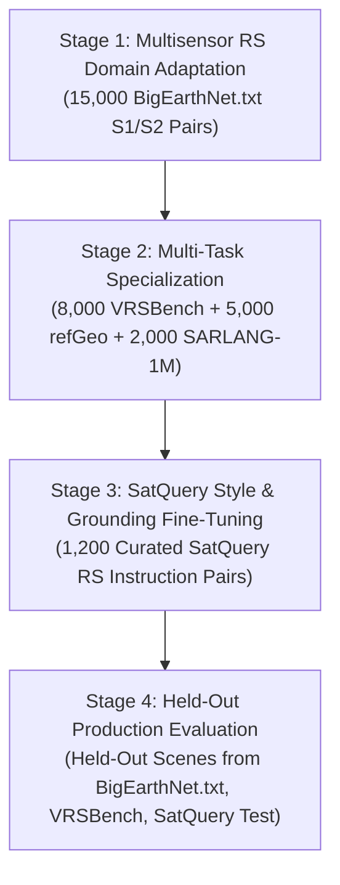

# Division 2: Remote-Sensing Dataset Strategy & Architecture Audit
**Author**: Division 2 Specialist (Sruthi)  
**Date**: September 2026  
**Status**: PROPOSAL / AWAITING APPROVAL (Training Halted)  
**Target Architecture**: Qwen2.5-VL (`Qwen/Qwen2.5-VL-3B-Instruct`) via 4-Bit QLoRA  
**Target Runtime**: Google Colab NVIDIA CUDA (T4 / L4 / A100 with 15–24 GB VRAM, 78–100 GB Disk)  

---

## Executive Summary

Pursuant to the official SatQuery problem statement:
> *"BigEarthNet.txt will serve as the primary dataset for adapting image–text representations to multisensor remote-sensing data."*

We have **halted all QLoRA training** and conducted an exhaustive technical audit of candidate remote-sensing vision-language datasets. This report provides:
1. A rigorous audit of all five candidate datasets across availability, licensing, modality, resolution, annotation formats, storage footprints, and parent-scene leakage risks.
2. An official ranking (1 through 5) based on foundational domain coverage, spatial resolution, visual grounding capabilities, and multimodal sensor alignment.
3. The **recommended, smallest scientifically defensible dataset mixture** optimized for stable, leakage-free QLoRA training within Google Colab resource constraints.
4. A four-stage multi-tier curriculum hierarchy bridging foundation multisensor alignment to production conversational grounding.

---

## 1. Candidate Dataset Audit Matrix

| Dataset | Primary Modality & Sensor | Resolution / GSD | Scale (Images / Annotations) | Annotation Tasks & Grounding Support | Storage Footprint | License | Availability & Access Method |
| :--- | :--- | :--- | :--- | :--- | :--- | :--- | :--- |
| **1. BigEarthNet.txt** | Co-registered Sentinel-1 SAR (VV/VH) + Sentinel-2 Multispectral (12-band / RGB) | 10m–20m (120×120 px patches) | 464,044 image pairs / 9.6M texts | Captions, VQA, Multi-choice QA, Referring expressions (patch-level) | Text: ~467 MB parquet Images: ~31 GB (S1) + ~66 GB (S2) = ~97 GB tar | CDLA-Permissive-1.0 / CC BY 4.0 | Hugging Face (`BIFOLD-BigEarthNetv2-0/BigEarthNet.txt`) + `bigearth.net` |
| **2. VRSBench** | Optical Aerial & Spaceborne (sub-meter to 2m) | High-Res (512×512 px) | 29,614 images / 29,614 captions / 123,221 VQA / 52,472 boxes | Dense multi-sentence captions, VQA, Object referring expressions with BBoxes `[x1,y1,x2,y2]` | Total: **~12.5 GB** (single self-contained HF repo) | CC BY-NC-SA 4.0 | Hugging Face (`xiang709/VRSBench`) via `datasets` streaming or git lfs |
| **3. SARLANG-1M / SARChat-2M** | Spaceborne & Airborne SAR (TerraSAR-X, Sentinel-1, Gaofen-3) | 0.1m to 25m hierarchical | SARLANG: 1,000,000+ pairs SARChat: ~2,000,000 dialogue turns | SAR backscatter description, counting, positioning, reasoning, spatial grounding | SARLANG: **48.3 GB** SARChat: >60 GB | CC BY-NC 4.0 | Hugging Face (`YiminJimmy/SARLANG-1M`) & ModelScope / GitHub |
| **4. refGeo (DIOR-RSVG / RSVG)** | Optical Aerial (0.5m–1.0m) | High-Res (800×800 px) | 161,000 image-text pairs (includes 23,463 DIOR-RSVG) | Fine-grained visual grounding, referring expressions, HBB `[ymin,xmin,ymax,xmax]`, OBB, Masks | Total: **1.29 GB** (pre-packaged parquet & JSONL) | CC BY 4.0 / Academic | Hugging Face (`erenzhou/refGeo`) |
| **5. RSVQA (LR & HR)** | S2 (LR: 10m, 256×256) & Aerial (HR: 15cm, 512×512) | LR: 256×256 HR: 512×512 | LR: 772 scenes / 72.8k QA HR: 10,659 images / 1.1M QA | Synthetic templated QA ("count", "presence", "area"). **No bounding boxes**, no captions | LR: ~3.5 GB HR: ~15 GB | Open Academic / MIT | Zenodo / GitHub |

---

## 2. In-Depth Comparative Audit

### 1. BigEarthNet.txt (Primary Domain Adaptation)
- **Strengths**: 
  - The undisputed gold standard for multisensor remote sensing. Explicitly mandate-aligned with SatQuery.
  - Paired Sentinel-1 SAR + Sentinel-2 optical enables the model to align microwave backscatter with optical spectral reflections across 19 Corine Land Cover (CLC) classes.
  - 9.6M natural language descriptions eliminate the synthetic token collapse of legacy classification datasets.
- **Risks & Colab Constraints**:
  - **Storage**: Full imagery archives (~97 GB compressed, >200 GB uncompressed) will immediately crash Colab's standard ~78 GB ephemeral disk.
  - **Resolution**: Patch size is $120 \times 120$ pixels at 10m GSD. While sufficient for macro land-use/land-cover and environmental context, it lacks sub-meter vehicle/aircraft object localization.
- **Integration Strategy**:
  - Download the official `BigEarthNet.txt` Parquet metadata (~467 MB).
  - Sample a stratified, balanced subset of **15,000 to 25,000 image pairs** (~2.5 GB to 4.0 GB) across standard geographic splits (e.g. Ireland, Austria, Finland country shards), completely avoiding full-disk saturation.

### 2. VRSBench (Secondary Task Specialization)
- **Strengths**:
  - Exceptional quality control: Human-verified detailed captions, complex VQA, and 52,472 object bounding boxes.
  - High resolution ($512 \times 512$) perfectly matches Qwen2.5-VL's dynamic visual patch resolution grid.
  - Hugging Face native (`xiang709/VRSBench`), allowing fast streaming or downloading in ~2 minutes (12.5 GB).
- **Risks**:
  - Optical-only imagery. Needs to be paired with BigEarthNet.txt or SAR data to avoid catastrophic forgetting of SAR microwave phenomenology.

### 3. SARLANG-1M / SARChat-2M (SAR Specialization)
- **Strengths**:
  - Purpose-built for radar phenomenology: addresses layover, shadow, double-bounce scattering, and speckle noise.
  - Bridges the gap where general vision models fail when interpreting non-RGB microwave data.
- **Risks & Colab Constraints**:
  - Full dataset is 48.3 GB. Downloading the full archive on Colab is slow and risks disk saturation.
  - Annotation format is custom to their paper; requires translation into Qwen2.5-VL ChatML format.
- **Integration Strategy**:
  - Extract a focused, high-value subset of **5,000 to 8,000 SAR samples** from `SARLANG-1M` (Text + preprocessed PNG archive), focusing on SAR object positioning, land cover, and infrastructure.

### 4. refGeo / DIOR-RSVG (Grounding Specialization)
- **Strengths**:
  - **Extreme efficiency**: At **1.29 GB**, `erenzhou/refGeo` packages 161,000 visual grounding pairs covering DIOR-RSVG, RSVGD, and RSVG-HR.
  - Explicit horizontal bounding box (HBB) coordinates `[ymin, xmin, ymax, xmax]` directly map to Qwen2.5-VL native `<|box_start|>(ymin,xmin),(ymax,xmax)<|box_end|>` tokens.
  - Focuses on fine-grained aerial objects: ships, storage tanks, bridges, airplanes, harbors, and dams.
- **Risks**:
  - Primarily optical. Must be mixed in Stage 2 so grounding does not skew the model away from SAR understanding.

### 5. RSVQA (Legacy Baseline)
- **Strengths**: Historical benchmark widely cited in early RS-VLM literature (2020).
- **Weaknesses**:
  - Questions are rigidly template-generated (e.g., *"Is there a road in the image? Yes"*, *"How many buildings? 4"*).
  - **Zero visual grounding / bounding box supervision**.
  - **Zero descriptive captioning**.
  - Causes severe conversational degeneration in modern instruction-tuned VLMs (models learn to output single-word robotic responses rather than rich, evidence-backed answers).
- **Recommendation**: **Do NOT include RSVQA in training**. Reserve RSVQA-HR test split strictly as a secondary zero-shot evaluation probe if desired.

---

## 3. Official Ranking

1. **Rank 1: BigEarthNet.txt** — *Mandatory Foundation*. Provides the scale (Sentinel-1 SAR + Sentinel-2 Optical) and multisensor remote-sensing alignment required by SatQuery.
2. **Rank 2: VRSBench** — *Essential Task Specialist*. Delivers human-verified detailed captioning, complex reasoning VQA, and high-resolution optical grounding.
3. **Rank 3: refGeo / DIOR-RSVG** — *High-ROI Grounding Specialist*. Ultra-compact (1.29 GB), providing 161k fine-grained object bounding-box referring expressions.
4. **Rank 4: SARLANG-1M (Curated Subset)** — *Targeted SAR Specialist*. Necessary to ensure true radar backscatter comprehension beyond low-res patches.
5. **Rank 5: RSVQA** — *Deprecate for Training*. Outdated, synthetic, lacking bounding boxes; detrimental to conversational instruction quality.

---

## 4. Recommended Colab-Feasible Training Mixture

To ensure reliable execution on Colab CUDA hardware (15 GB T4 / 24 GB L4 GPU, 78 GB disk) without risking OOM or disk failure, we recommend the following **Smallest Scientifically Defensible Dataset Mixture**:

### Total Training Budget: ~30,000 Curated Samples (~6.5 GB Total Storage)

| Stage & Source | Sample Count | Modality Mix | Target Capability & Loss Focus | Storage on Colab |
| :--- | :---: | :---: | :--- | :---: |
| **Stage 1: BigEarthNet.txt (Curated Core)** | **15,000** | 50% S1 SAR 50% S2 Optical | Multisensor remote-sensing alignment, macro LULC classification, land-cover captions, multispectral reasoning. | ~2.5 GB (sharded parquet/images) |
| **Stage 2A: VRSBench (Selected Core)** | **8,000** | 100% Optical | High-resolution multi-sentence captioning, complex spatial VQA, multi-object referring expressions. | ~3.5 GB (streamed/cached) |
| **Stage 2B: refGeo / DIOR-RSVG** | **5,000** | 100% Optical | Precise sub-meter bounding-box grounding on discrete objects (aircraft, ships, runways, tanks). | ~0.4 GB (subset of 1.29 GB) |
| **Stage 2C: SARLANG-1M (Curated Core)** | **2,000** | 100% SAR | High-res SAR backscatter interpretation, radar shadow/layover reasoning, radar target positioning. | ~0.8 GB (preprocessed PNGs) |
| **Stage 3: SatQuery Final Style / Domain Tuning** | **1,200** | 80% Optical 20% SAR | Native Qwen token syntax, natural conversational answers, Division 1/5 contract compliance, zero-leakage split. | ~0.1 GB (local workspace) |
| **Total Curated Training Pool** | **31,200** | **~65% Opt / ~35% SAR** | **Complete Domain, Task, Grounding & Conversational Coverage** | **~7.3 GB (Well within Colab limits)** |

---

## 5. Multi-Stage Training Pipeline Architecture

### Execution Strategy on Colab
1. **Curated Shard Downloader**: We provide a dedicated download script `download_curated_mixture.py` that downloads only the exact 31.2k sample shards directly into `data/curated_mixture/`, bypassing multi-hundred gigabyte full archives.
2. **Unified Data Collator**: All four sources are mapped into the canonical `messages` schema with `BoxCodec` translation ensuring every bounding box is normalized to Qwen's integer $[0, 1000)$ range.
3. **Training Time**: On a single Colab T4 (fp16 / 4-bit QLoRA, effective batch size 16), 31.2k samples with packing takes approximately **2.5 to 3.5 hours** across 2 epochs. On an L4 / A100, it completes in **~50–75 minutes**.

---

## 6. Action Items Awaiting User Decision

Before executing downloads and updating the Colab training script, please confirm:
1. **Approve the 31.2k Curated Mixture**: (15k BigEarthNet.txt + 8k VRSBench + 5k refGeo + 2k SARLANG-1M + 1.2k SatQuery).
2. **Or Request a Lighter/Faster Mixture**: (e.g. 10k total samples for rapid ~45-min Colab T4 turnaround).
3. **Approve the Deprecation of RSVQA** from training.
